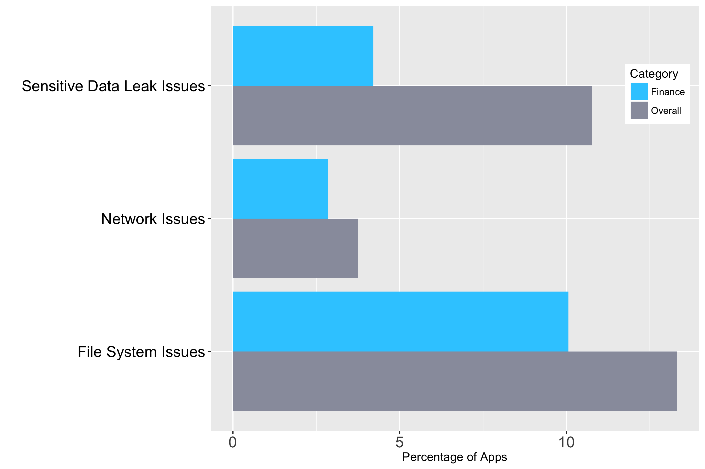

# Finance

Apps in the Finance category include banking applications, payment apps, and insurance apps. These apps might store credit card information, allow for sending currency, and save personal banking information.

We tested 5,201 apps within Google Play’s Finance category. We find that users install an average of 1.8 finance apps on their device. Finance apps were more secure than the average app illustrated by our finding at least one high risk vulnerability in only 16.9 percent of them, which is 7.8 percent lower than in the average app. We identified file system issues in only 10.1 percent of finance apps, 3.3 percent less than the average app. Only 4.2 percent of the finance apps we tested leaked sensitive data, which is 6.6 percent less than the average.