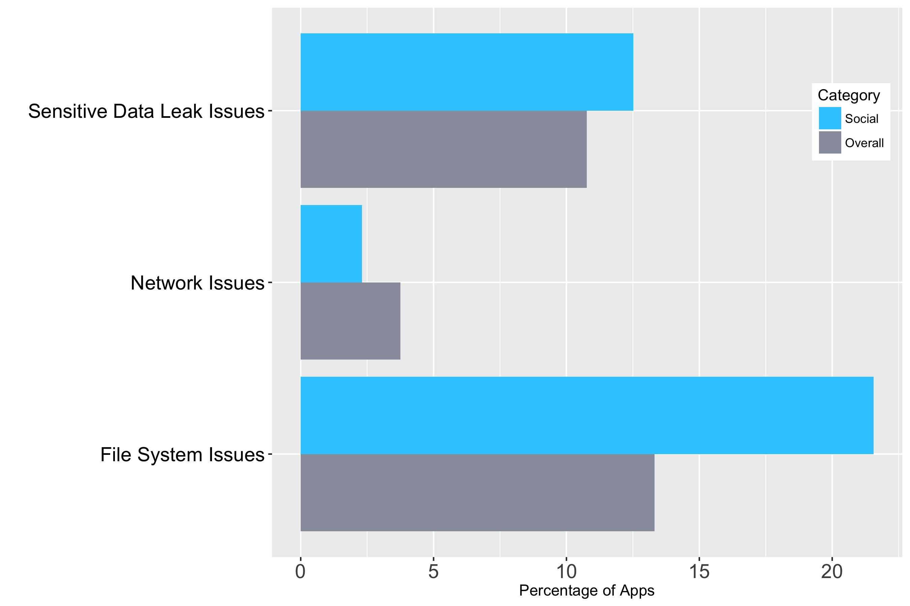

# Social

Communication apps that allow users to participate in social media make up the Social category. These applications share messages, photos, videos, and other media through popular social media platforms. 

We tested 4,503 apps within Google Play’s Social category. Users install an average of 3.7 social apps on their mobile device. We found at least one high risk vulnerability in 30.5 percent of social apps - 5.8 percent more than in the average app. Compared to apps overall, social apps are 4.1 times more likely to leak a username, 3.8 times more likely to leak a password, and 4.7 times more likely to leak a user’s email address.
